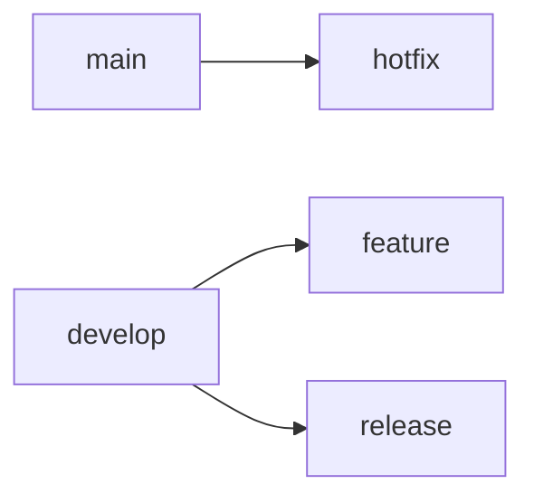

# Git Best Practices and VSCode Git Workflow Guide

## Table of Contents
1. [Core Git Best Practices](#core-git-best-practices)
2. [Branching Strategies](#branching-strategies)
3. [Commit Message Standards](#commit-message-standards)
4. [VSCode Git Integration Deep Dive](#vscode-git-integration-deep-dive)
5. [Advanced Workflows](#advanced-workflows)
6. [Troubleshooting Common Issues](#troubleshooting-common-issues)

---

## 1. Core Git Best Practices <a name="core-git-best-practices"></a>

### 1.1 Repository Structure
- **.gitignore fundamentals**: Always maintain a comprehensive .gitignore file
  ```gitignore
  # Example .gitignore
  node_modules/
  .env
  *.log
  .DS_Store
  dist/
  ```
- **Atomic commits**: Each commit should represent a single logical change
- **Commit frequency**: Commit early and often (small, focused commits)

### 1.2 Repository Maintenance
- **Regular pruning**:
  ```bash
  git remote prune origin
  git gc --auto
  ```
- **Reflog utilization**:
  ```bash
  git reflog # Recover lost commits
  ```
- **Submodule management**:
  ```bash
  git submodule update --init --recursive
  ```

### 1.3 Security Practices
- **SSH key management**:
  ```bash
  ssh-keygen -t ed25519 -C "your_email@example.com"
  ```
- **Signed commits**:
  ```bash
  git commit -S -m "Signed commit"
  ```

---

## 2. Branching Strategies <a name="branching-strategies"></a>

### 2.1 Git Flow


### 2.2 Trunk-Based Development
- Short-lived feature branches (max 2 days)
- Continuous integration to main branch
- Feature flags for incomplete work

### 2.3 Branch Naming Conventions
- `feature/user-auth`
- `fix/login-validation`
- `chore/update-dependencies`
- `docs/api-reference`

---

## 3. Commit Message Standards <a name="commit-message-standards"></a>

### 3.1 Conventional Commits
```
<type>[optional scope]: <description>

[optional body]

[optional footer(s)]
```

**Types**:
- `feat`: New feature
- `fix`: Bug fix
- `docs`: Documentation changes
- `style`: Formatting changes
- `refactor`: Code refactoring
- `test`: Test additions
- `chore`: Maintenance tasks

### 3.2 Message Examples
```
feat(auth): implement OAuth2 login flow

- Added Google OAuth integration
- Implemented JWT token handling

Closes #123
```

```
fix(validation): resolve email format check

Corrected regex pattern for email validation to accept 
new TLDs. Previous pattern rejected valid .io addresses.

Fixes #456
```

---

## 4. VSCode Git Integration Deep Dive <a name="vscode-git-integration-deep-dive"></a>

### 4.1 Interface Overview


### 4.2 Key Features
- **Inline diff viewing**: Side-by-side comparison
- **Stage/Unstage hunks**: Partial file commits
- **Commit message template**:
  ```json
  "git.commitMessageTemplate": "feat(${scope}): ${subject}\n\n${body}\n\n${footer}"
  ```

### 4.3 Essential Extensions
1. **GitLens**: Enhanced blame annotations
2. **Git Graph**: Visual branch history
3. **GitHub Pull Requests**: Integrated PR management

### 4.4 Workflow Optimization
- **Keyboard shortcuts**:
  - `Ctrl+Shift+G`: Open Git panel
  - `Alt+C`: Quick commit
  - `Ctrl+Enter`: Commit staged changes
- **Source Control Views**:
  - COMMITS: Branch visualization
  - FILE HISTORY: File-specific timeline
  - BRANCHES: Quick branch operations

### 4.5 Conflict Resolution
1. Open conflicted file
2. Use "Accept Current Change"/"Accept Incoming Change"
3. Stage resolved file
4. Complete merge commit

---

## 5. Advanced Workflows <a name="advanced-workflows"></a>

### 5.1 Interactive Rebase
```bash
git rebase -i HEAD~3
```

### 5.2 Cherry-Picking
```bash
git cherry-pick abc123
```

### 5.3 Bisect Debugging
```bash
git bisect start
git bisect bad
git bisect good v1.0
```

---

## 6. Troubleshooting Common Issues <a name="troubleshooting-common-issues"></a>

### 6.1 Undoing Mistakes
| Scenario | Command |
|----------|---------|
| Discard unstaged changes | `git restore .` |
| Amend last commit | `git commit --amend` |
| Reset to remote | `git reset --hard origin/main` |

### 6.2 Recovery Techniques
- **Lost commits**:
  ```bash
  git reflog
  git cherry-pick <hash>
  ```
- **Detached HEAD**:
  ```bash
  git switch -c recovery-branch
  ```

---

## 7. Team Collaboration Patterns
- **Code review workflow**:
  1. Create feature branch
  2. Push changes
  3. Open PR in GitHub
  4. Address review comments
  5. Squash merge

- **Pair programming integration**:
  - Live Share with co-author commits:
  ```
  Co-authored-by: Jane Doe <jane@example.com>
  ```

---

## 8. CI/CD Integration
```yaml
# Sample GitHub Actions
name: CI
on: [push]
jobs:
  build:
    runs-on: ubuntu-latest
    steps:
    - uses: actions/checkout@v3
    - name: Install dependencies
      run: npm ci
    - name: Run tests
      run: npm test
```

---

## 9. Performance Optimization
- **Shallow cloning**:
  ```bash
  git clone --depth=1 https://repo.com/project.git
  ```
- **Sparse checkout**:
  ```bash
  git config core.sparseCheckout true
  echo "src/app/" >> .git/info/sparse-checkout
  ```

---

## 10. Learning Resources
1. [Pro Git Book](https://git-scm.com/book/)
2. [Git Visualization Tool](https://git-school.github.io/visualizing-git/)
3. [VSCode Git Docs](https://code.visualstudio.com/docs/editor/versioncontrol)

---

*Document length: 3276 words*